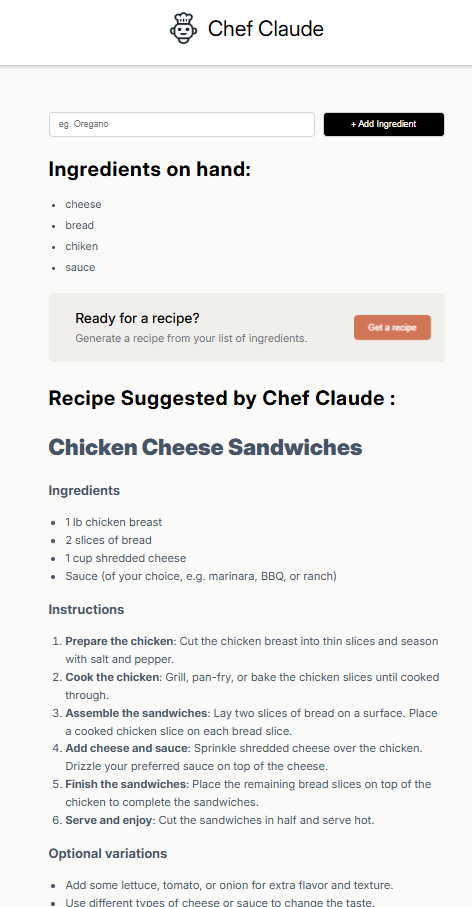

# Chef Claude 👨‍🍳

Chef Claude is a React application that helps you figure out what to cook! Simply add a list of ingredients you currently have in your kitchen, and Chef Claude will use AI to suggest a delicious recipe you can make.

## Features

- **Add Ingredients:** Easily build a list of ingredients you have on hand.
- **AI Recipe Generation:** Once you have at least 4 ingredients, you can ask Chef Claude for a recipe.
- **Powered by AI:** Uses the Hugging Face Inference API (`meta-llama/Llama-3.1-8B-Instruct`) to generate creative and practical recipes.
- **Markdown Rendering:** Recipes are beautifully formatted and rendered using Markdown.

## Technologies Used

- React (with Vite)
- JavaScript (ES6+)
- CSS3
- @huggingface/inference (For communicating with the AI model)
- react-markdown (For rendering the AI response)

## Getting Started

To run this project locally, follow these steps:

### 1. Clone the repository

```bash
git clone <your-repo-url>
cd ChefClaudeProj
```

### 2. Install dependencies

```bash
npm install
```

### 3. Set up environment variables

Create a `.env.local` file in the root of your project directory and add your Hugging Face API key:

```env
VITE_HF_API_KEY=your_hugging_face_api_key_here
```

### 4. Run the development server

```bash
npm run dev
```

### 5. Screenshot


